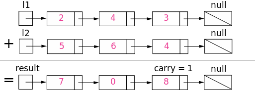

# [2. Add Two Numbers](https://leetcode.com/problems/add-two-numbers/)

## [描述](https://leetcode.com/problems/add-two-numbers/)

You are given two non-empty linked lists representing two non-negative integers. The digits are stored in reverse order and each of their nodes contain a single digit. Add the two numbers and return it as a linked list.

You may assume the two numbers do not contain any leading zero, except the number 0 itself.

**Example**:

```text
Input: (2 -> 4 -> 3) + (5 -> 6 -> 4)
Output: 7 -> 0 -> 8
Explanation: 342 + 465 = 807.
```

## 解法

### 非递归



思路就是遍历两个链表，同时记录进位`carry`。

```python
# Definition for singly-linked list.
# class ListNode:
#     def __init__(self, x):
#         self.val = x
#         self.next = None
class Solution:
    def addTwoNumbers(self, l1: ListNode, l2: ListNode) -> ListNode:
        ret = ListNode(0)
        head = ret
        carry = 0

        while l1 or l2 or carry:
            val1 = l1.val if l1 else 0
            val2 = l2.val if l2 else 0

            l1 = l1.next if l1 and l1.next else None
            l2 = l2.next if l2 and l2.next else None

            carry, val = divmod(val1 + val2 + carry, 10)
)
            head.next = ListNode(val)
            head = head.next
        return ret.next
```

一个更清晰和简洁的`python`[解法](https://leetcode.com/problems/add-two-numbers/discuss/1016/Clear-python-code-straight-forward)，这里稍微改写了一些：

```python
# Definition for singly-linked list.
# class ListNode:
#     def __init__(self, x):
#         self.val = x
#         self.next = None
class Solution:
    def addTwoNumbers(self, l1: ListNode, l2: ListNode) -> ListNode:
        carry = 0
        root = cur = ListNode(None)

        while l1 or l2 or carry:
            if l1:
                carry += l1.val
                l1 = l1.next
            if l2:
                carry += l2.val
                l2 = l2.next

            carry, val = divmod(carry, 10)
            cur.next = ListNode(val)
            cur = cur.next

        return root.next
```

复杂度分析：

- 时间复杂度：$$O(max(m, n))$$，因为最多迭代$$max(m, n)$$次。
- 空间复杂度：$$O(max(m, n))$$，因为链表最长$$max(m, n) + 1$$。

### 递归

递归的写法比较难理解，仅做为参考学习。

```python
# Definition for singly-linked list.
# class ListNode:
#     def __init__(self, x):
#         self.val = x
#         self.next = None

class Solution:
    def addTwoNumbers(self, l1: ListNode, l2: ListNode, carry=0) -> ListNode:
        val = l1.val + l2.val + carry
        carry, val = divmod(val, 10)
        ret = ListNode(val)

        if l1.next or l2.next or carry:
            if not l1.next:
                l1.next = ListNode(0)
            if not l2.next:
                l2.next = ListNode(0)
            ret.next = self.addTwoNumbers(l1.next, l2.next, carry)

        return ret
```

## 拓展

**Follow up:**

What if the the digits in the linked list are stored in non-reversed order? For example:

$$(3 \to 4 \to 2) + (4 \to 6 \to 5) = 8 \to 0 \to 7$$

如果链表顺序反过来怎么办？

### 划归：先反转链表再相加

迭代反转链表：

```python
class ListNode:
    def __init__(self, v):
        self.val = v
        self.next = None

def reverseList(head: ListNode) -> ListNode:
    pre = None
    while head:
        next = head.next
        head.next = pre
        pre = head
        head = next
    return pre
```

递归反转链表：

```python
def reverseList(head: ListNode) -> ListNode:
    if not head or not head.next:
        return head

    ret = reverseList(head.next)
    head.next.next = head
    head.next = null
    return ret
```

此时问题就转化回了原始的问题，但是引进了额外的时间和空间消耗。

### 直接递归

???

### 两数相加再转成链表

把两个链表转为自然数，相加得到结果后，构造新链表。

```python
class Solution:
    def addTwoNumbers(self, l1: ListNode, l2: ListNode) -> ListNode:
        node = l1
        num1 = 0
        while node:
            num1 = num1 * 10 + node.val
            node = node.next

        node = l2
        num2 = 0
        while node:
            num2 = num2 * 10 + node.val
            node = node.next

        total = num1 + num2

        if not total:
            return ListNode(total)

        res = None

        while total:
            total, digit = divmod(total, 10)
            new_node = ListNode(digit)
            new_node.next = res
            res = new_node

        return res
```