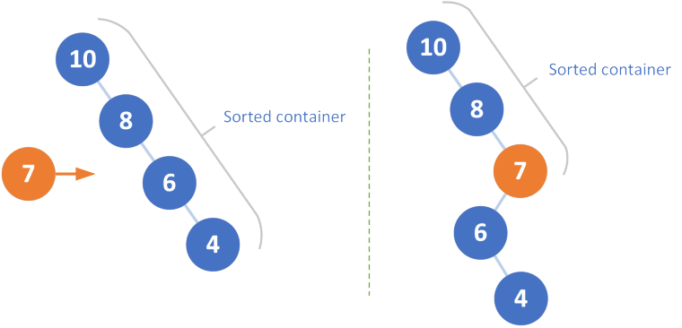

# [654. Maximum Binary Tree](https://leetcode.com/problems/maximum-binary-tree/)

## [描述](https://leetcode.com/problems/maximum-binary-tree/)

Given an integer array with no duplicates. A maximum tree building on this array is defined as follow:

The root is the maximum number in the array.
The left subtree is the maximum tree constructed from left part subarray divided by the maximum number.
The right subtree is the maximum tree constructed from right part subarray divided by the maximum number.
Construct the maximum tree by the given array and output the root node of this tree.

**Example 1:**

```text
Input: [3,2,1,6,0,5]
Output: return the tree root node representing the following tree:

      6
    /   \
   3     5
    \    /
     2  0
       \
        1
```

**Note:**

```text
The size of the given array will be in the range [1,1000].
```

## 解法

### 分治

先找到列表中的最大元素 `max_val`，将其作为当前列表的 `root` 节点。根据题意，`max_val` 左边的元素都构成其左子树，右边的元素构成其右子树，每一边的元素都依据完全相同的规则。因此分别递归实现即可，注意递归终止的条件是**列表中没有或只有一个数字**。

```python
class Solution:
    def constructMaximumBinaryTree(self, nums: List[int]) -> TreeNode:
        if not nums:
            return None
        if len(nums) == 1:
            return TreeNode(nums[0])

        max_val = max(nums)
        index = nums.index(max_val)

        root = TreeNode(max_val)
        root.left = self.constructMaximumBinaryTree(nums[:index])
        root.right = self.constructMaximumBinaryTree(nums[index + 1:])

        return root
```

时间复杂度：$$O(n^2)$$

空间复杂度：$$O(n)$$

### [使用栈记录元素大小](https://leetcode.com/problems/maximum-binary-tree/discuss/106146)

> 如果数字正在减少，我们会填充右子树。如果当前数字较大，则右子树的较小部分将成为当前数字的左子树，从而使当前数字成为右子树中的叶子(最小值)。



```python
class Solution:
    def constructMaximumBinaryTree(self, nums: List[int]) -> TreeNode:
        stack = []

        for num in nums:
            cur = TreeNode(num)

            # cur's index is larger than any nodes in stack
            # while this condition is true
            # means val of some nodes in the stack is less than cur.val
            # so the node who has maxmium val among those nodes metioned before
            # should be the left child of cur
            while stack and stack[-1].val < num:
                cur.left = stack.pop()

            # if there still exists node whose val is larger than cur
            # cur should be its right child
            # cause cur's index is larger than that node
            if stack:
                stack[-1].right = cur

            # push cur at the end of stack
            stack.append(cur)

        return stack[0]  # stack[0] is the final root
```

时间复杂度：$$O(n)$$

空间复杂度：$$O(n)$$